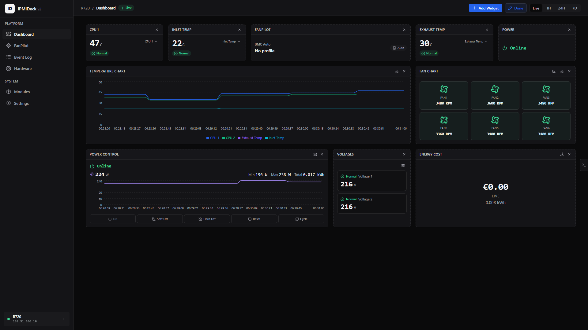
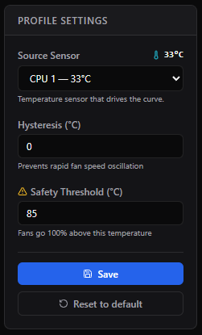
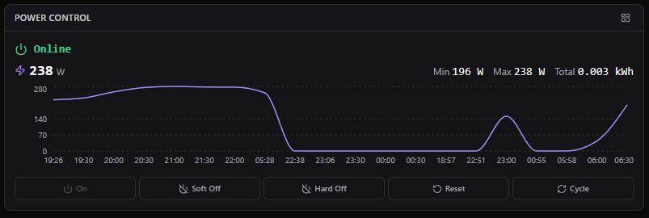
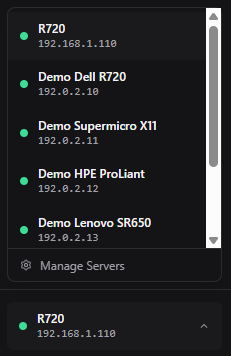
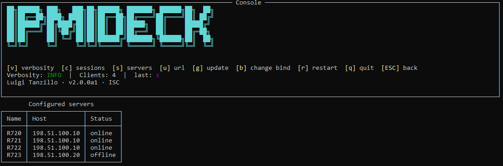
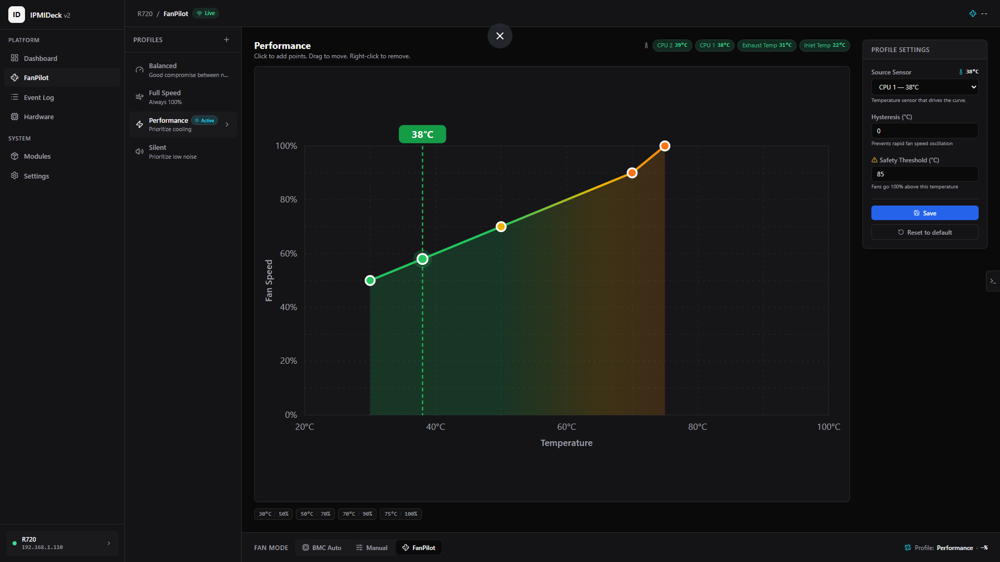
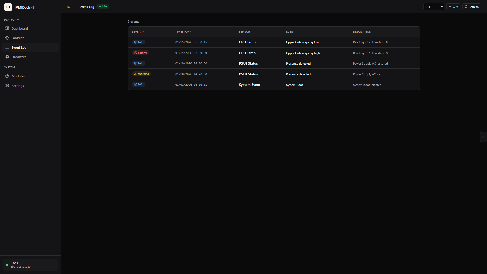
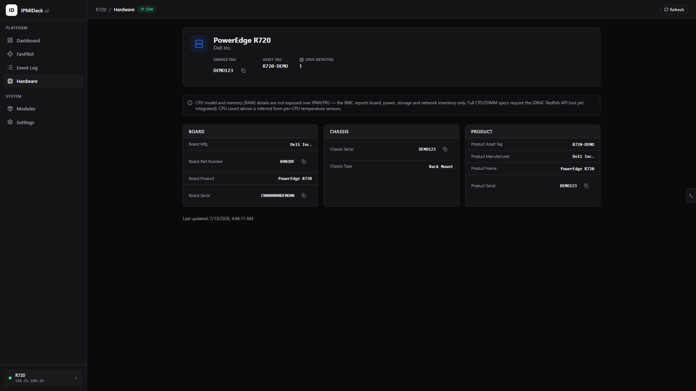
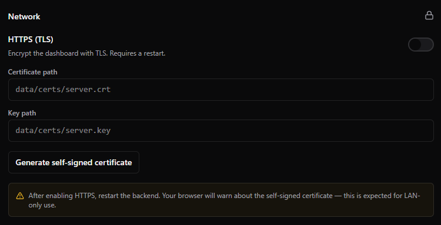
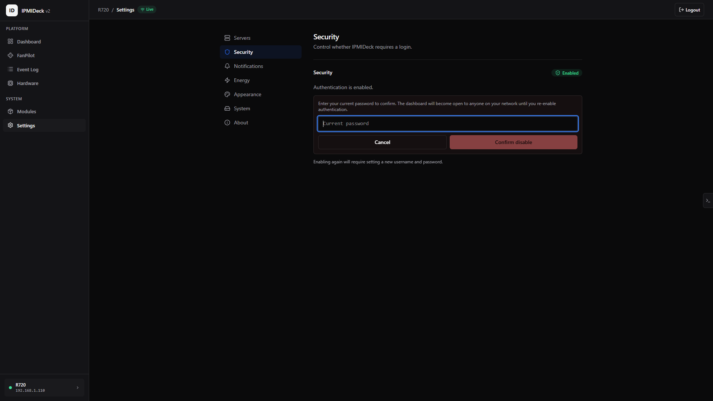

<h1 align="center">🖥️ IPMIDeck</h1>

<p align="center"><strong>Web-based IPMI management platform — monitor sensors, control fans, manage power, all from your browser.</strong></p>

<p align="center">
  
</p>

<p align="center">
  <a href="https://www.python.org/"></a>
  <a href="LICENSE"></a>
  <a href="https://hub.docker.com/r/devluigi06/ipmideck"></a>
  <a href="https://pypi.org/project/ipmideck/"></a>
  
</p>

<p align="center"><strong>Documentation:</strong> <a href="https://docs.ipmideck.com">docs.ipmideck.com</a></p>

<p align="center">
  <a href="#features">Features</a> •
  <a href="#quick-start">Quick Start</a> •
  <a href="#documentation">Documentation</a> •
  <a href="#configuration">Configuration</a> •
  <a href="#supported-hardware">Supported Hardware</a>
</p>

IPMIDeck is a self-hosted dashboard that connects to your servers' BMC (Baseboard Management Controller) via IPMI. It provides real-time sensor monitoring, intelligent fan curve control (FanPilot), remote power management, and hardware event logs — no CLI required.

---

## Features

### Sensor Monitoring
- Real-time temperature, fan RPM, voltage, and power consumption
- Live charts with historical data (up to 1 year)
- Configurable alert thresholds with browser notifications

### FanPilot — Intelligent Fan Control
- Visual drag-and-drop fan curve editor
- Built-in profiles: Silent, Balanced, Performance, Full Speed, Custom
- Configurable hysteresis to prevent fan oscillation
- Safety override: fans go to 100% above critical temperature
- Autonomous loop — works independently of the dashboard



### Power Control
- Power On, Soft Off, Hard Off, Reset, Power Cycle
- Real-time power status indicator
- Confirmation dialogs for destructive actions
- Full command audit log



### System Event Log (SEL)
- View BMC hardware event log with severity filtering
- Search, date range filters, export to CSV/JSON

### Hardware Inventory (FRU)
- Serial numbers, part numbers, manufacturer info
- Board, chassis, and product data at a glance

### Multi-Server Dashboard
- Manage multiple BMCs from a single instance
- Panoramic view with status overview of all servers



---

## Quick Start

### Docker (recommended)

Pull from Docker Hub (primary registry):

```bash
docker pull devluigi06/ipmideck:latest

# Linux (reaches BMCs on your LAN via UDP 623):
docker run -d --name ipmideck --network host \
  -v ipmideck-data:/data \
  devluigi06/ipmideck:latest

# Windows / macOS (Docker Desktop has no host networking — map the port instead):
docker run -d --name ipmideck -p 3000:3000 \
  -v ipmideck-data:/data \
  devluigi06/ipmideck:latest
```

Or with Docker Compose:

```bash
docker compose up -d                                  # pull&go (docker-compose.yml)
docker compose -f docker-compose.dev.yml up --build   # build from source
```

Open `http://<your-ip>:3000` and follow the setup wizard.

> `--network host` (Linux) lets the container reach BMCs on your local network via UDP 623.
> On Windows/macOS use `-p 3000:3000`.

### pip

```bash
pip install ipmideck
ipmideck start
```

Requires `ipmitool` installed on the system.

---

## Documentation

Full documentation lives at **[docs.ipmideck.com](https://docs.ipmideck.com/en/getting-started)** — start with the [Getting Started guide](https://docs.ipmideck.com/en/getting-started). The docs cover installation, first-run setup, per-vendor **Enable IPMI** guides (Dell iDRAC, HPE iLO, Supermicro, Lenovo XCC, IBM IMM), configuration, the CLI and interactive console, the FAQ, and troubleshooting.

---

## Tech Stack

| Component | Technology |
|---|---|
| Backend | Python / FastAPI / Uvicorn |
| Frontend | React / Vite / TypeScript / Recharts |
| Styling | Tailwind CSS |
| Database | SQLite (aiosqlite) |
| IPMI | ipmitool (subprocess) |
| Packaging | Docker / pip |

---

## Configuration

Configuration is auto-generated at first run at `/data/config.yaml` (Docker / Linux) or `./data/config.yaml` (Windows). Override the data directory with `IPMIDECK_DATA_DIR`.

A documented subset of settings can be overridden with `IPMIDECK_`-prefixed environment variables:

```bash
IPMIDECK_SERVER_PORT=8080
IPMIDECK_IPMI_POLL_INTERVAL=30
IPMIDECK_LOGGING_LEVEL=info
IPMIDECK_DATA_RETENTION_DAYS=180
```

Every key is written to that `config.yaml` on first run — read it for the full list. The same
settings are also editable at runtime from the in-app **Settings** page.

---

## Interactive Console

Launched on a host with an attached terminal (a TTY — e.g. `ipmideck start` run directly, not under Docker, systemd, or a pipe), IPMIDeck opens an interactive operator console: a pinned header with keybindings above a live, streaming log. From it you can cycle log verbosity, inspect active sessions and configured servers, print the access URL, change the bind address, and restart or quit — without leaving the terminal.



Keys: `[v]` verbosity · `[c]` sessions · `[s]` servers · `[u]` url · `[g]` update · `[b]` change bind · `[r]` restart · `[q]` quit · `[ESC]` back. The console is not shown when IPMIDeck runs under Docker, systemd, or with piped output — there it logs plainly to stdout.

> The hosts shown are RFC5737 documentation addresses, not real servers.

See the [Interactive Console docs](https://docs.ipmideck.com/en/console) for full details.

---

## Screenshots

### FanPilot — visual fan curve editor



### System Event Log — BMC hardware events



### Hardware Inventory (FRU) — board, chassis, and product data



> Hardware identifiers are synthetic and the hosts shown are RFC5737 documentation addresses.

---

## Development

### Prerequisites

- Python 3.11+
- Node.js 20+ (for frontend development)
- ipmitool

### Setup

```bash
git clone https://github.com/ipmideck/IPMIDeck.git
cd IPMIDeck

# Backend — run from the repo root (pyproject.toml lives here)
python -m venv .venv
source .venv/bin/activate  # Linux/Mac
# .venv\Scripts\activate   # Windows
pip install -e ".[dev]"

# Frontend
cd frontend
npm install
npm run dev
```

### Run

```bash
# Backend — from the repo root (serves API + static frontend build)
uvicorn backend.main:app --reload --port 3000
# or:  python -m backend.main --reload
# or:  ipmideck start --reload   (after `pip install -e ".[dev]"`)

# Frontend dev server (with HMR, proxies API to backend)
cd frontend
npm run dev
```

---

## Project Structure

```
ipmideck/
├── backend/
│   ├── main.py              # FastAPI app + lifespan + CLI entry point
│   ├── console.py           # interactive TTY operator console
│   ├── core/                # database, auth, crypto, config, branding, events,
│   │                        #   websocket, modules (loader), ipmi_service, ipmi_demo
│   ├── api/                 # auth / server / dashboard / system / module routes
│   ├── models/              # Pydantic schemas
│   ├── modules/             # self-contained feature modules
│   │   │                    #   (manifest + routes + tasks + migrations each)
│   │   ├── sensors/
│   │   ├── fanpilot/        #   + engine.py (curve / hysteresis / safety override)
│   │   ├── power/
│   │   ├── sel/
│   │   └── fru/
│   └── static/              # compiled React SPA (build artifact — do not hand-edit)
├── frontend/
│   ├── src/
│   │   ├── pages/           # Dashboard, FanPilot, SEL, FRU, Settings, Login, Setup
│   │   ├── components/      # common/, dashboard/, layout/
│   │   ├── modules/         # per-module widgets (sensors, fanpilot, power)
│   │   ├── stores/          # Zustand stores
│   │   ├── hooks/           # useWebSocket, useKeyboardShortcuts, …
│   │   ├── i18n/locales/    # 12 language catalogs
│   │   ├── api/             # HTTP client
│   │   ├── lib/
│   │   └── styles/
│   └── vite.config.ts
├── scripts/                 # rebuild-spa, check-spa-built, check-i18n-parity,
│                            #   check-wheel, lint-workflows, smoke-docker
├── tests/                   # unit/, integration/, fixtures/ipmi/
├── Dockerfile
├── docker-compose.yml
├── docker-compose.dev.yml
├── .dockerignore
└── pyproject.toml
```

---

## Security

- Local authentication with bcrypt password hashing
- Opaque session tokens, HMAC-SHA256 signed with a per-install secret, with configurable expiry
- BMC credentials encrypted at rest with AES-256-CBC. The 32-byte key is randomly generated and
  stored in `<data_dir>/encryption.key` — deliberately **outside** the database, so a stolen DB
  alone decrypts nothing (back the key file up separately)
- BMC passwords are never placed on the command line — `ipmitool` reads them from the environment
  (`-E` / `IPMITOOL_PASSWORD`), so they never appear in `ps`
- No external network dependencies — fully offline capable
- ipmitool arguments are passed as a list, never through a shell (no shell-injection surface)
- Optional HTTPS/TLS for the dashboard, with one-click self-signed certificate generation





---

## Supported Hardware

Sensor monitoring, power control, SEL and FRU work on **any** server with an IPMI 2.0 BMC.

**Fan control (FanPilot) is vendor-specific.** The table below is the honest support matrix — it
mirrors the vendor profiles the app actually ships, and the same tier badges appear in the vendor
picker when you add a server:

| Vendor | Fan control | Tier | Notes |
|---|---|---|---|
| **Dell PowerEdge** (iDRAC) | Yes | Tested | Raw iDRAC fan commands, validated on real hardware (PowerEdge R720) |
| **Supermicro** (X10+) | Yes | Experimental | Both fan zones |
| **IBM System x** (IMM) | Yes | Experimental | Dual fan bank |
| **HPE ProLiant** (iLO) | No | Monitoring-only | iLO exposes no IPMI fan-control interface |
| **Lenovo ThinkSystem** (XCC) | No | Monitoring-only | No reliable in-band restore path |
| **Generic / unknown BMC** | No | Monitoring-only | Never issues raw vendor writes it cannot verify |

Monitoring-only vendors still get full sensor, power, SEL and FRU support — FanPilot simply leaves
their fans under BMC control rather than sending raw commands it cannot confirm.

---

## License

[Apache-2.0](https://github.com/ipmideck/IPMIDeck/blob/main/LICENSE)

---

## Author

**Luigi Tanzillo** — [github.com/dev-luigi](https://github.com/dev-luigi)

---

## Disclaimer

This tool is provided as-is for managing IPMI-enabled servers. Use at your own risk. Improper fan control can damage hardware. Always test in a non-production environment first. The author is not responsible for any damage caused by misuse of this application.

---

## Star History

<a href="https://www.star-history.com/?repos=ipmideck%2FIPMIDeck&type=date&legend=top-left">
 <picture>
   <source media="(prefers-color-scheme: dark)" srcset="https://api.star-history.com/chart?repos=ipmideck/IPMIDeck&type=date&theme=dark&legend=top-left" />
   <source media="(prefers-color-scheme: light)" srcset="https://api.star-history.com/chart?repos=ipmideck/IPMIDeck&type=date&legend=top-left" />
   
 </picture>
</a>
